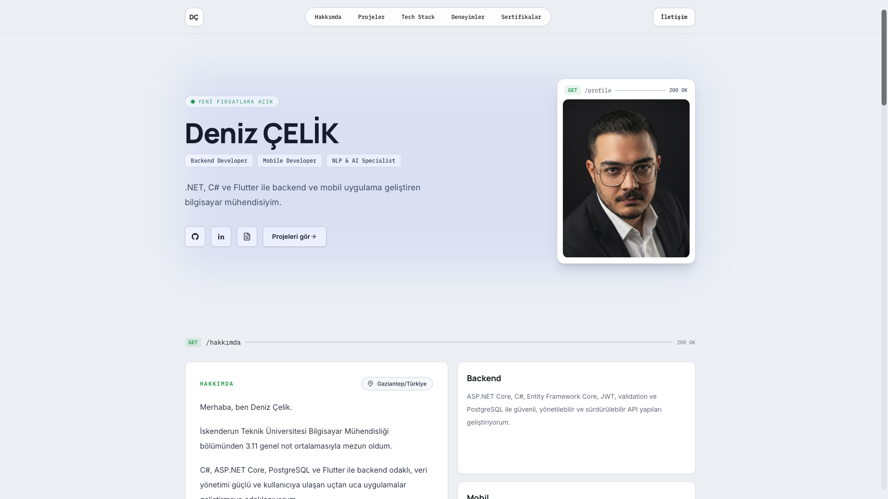
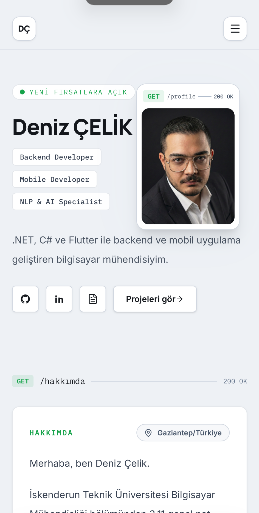
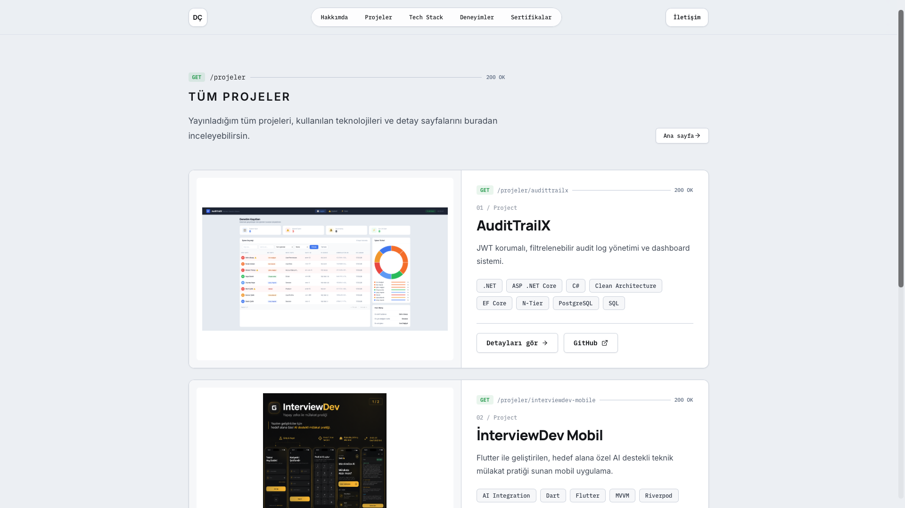
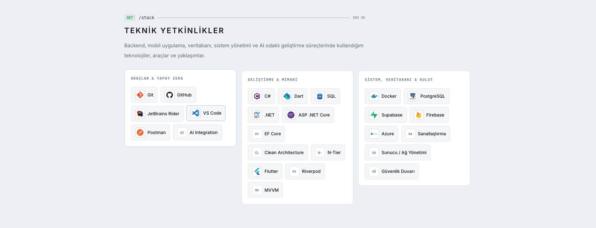
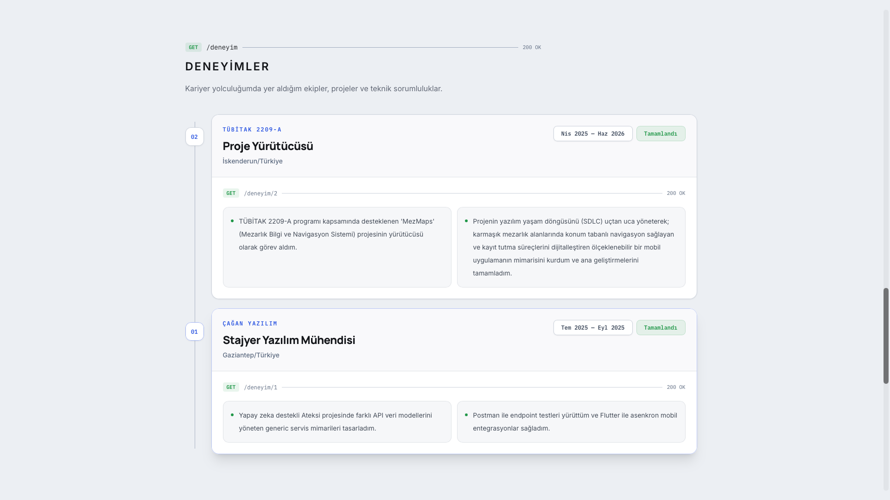
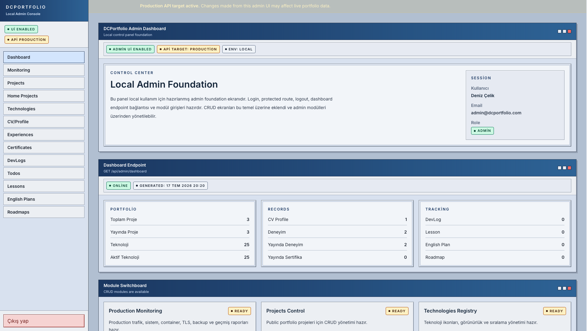
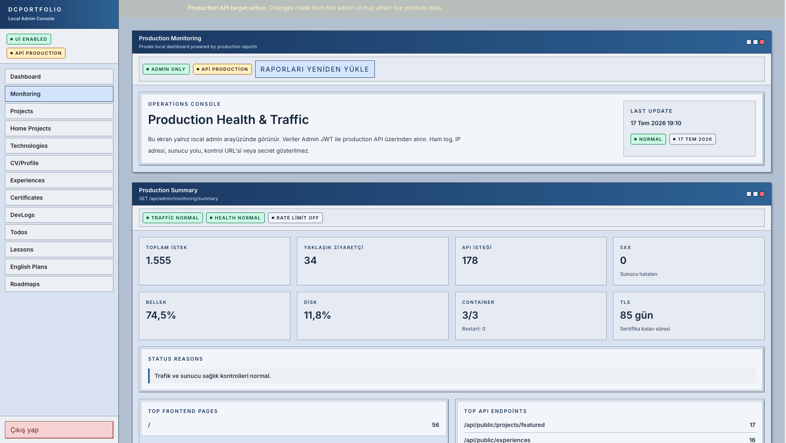
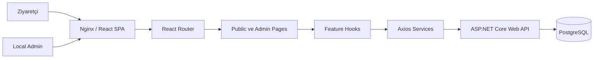
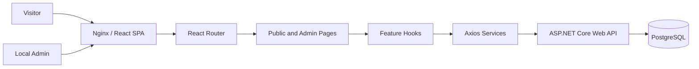

<div align="center">

<p>
  <a href="#turkce">Türkçe</a>
  ·
  <a href="#english">English</a>
</p>

<h1>DCPortfolio Frontend</h1>

<p>
  React, TypeScript ve Vite ile geliştirilen; canlı portföy, yerel admin paneli
  ve production monitoring deneyimini bir araya getiren modern frontend uygulaması.
</p>

<p>
  <a href="https://denizcelik.tr"><strong>Canlı Portföy</strong></a>
  ·
  <a href="https://github.com/Deniz-Kmr/DCPortfolio-Backend"><strong>Backend Repository</strong></a>
</p>

<p>
  
  
  
  
</p>

<p>
  
  
  
  
  
</p>

<p>
  
  
  
  
  
  
</p>

</div>

---

<a id="turkce"></a>

# Türkçe

## Proje Hakkında

DCPortfolio Frontend; kişisel portföy içeriklerini production ortamındaki
ASP.NET Core Web API üzerinden sunan, responsive ve API dokümantasyonu
yaklaşımından ilham alan bir React uygulamasıdır.

Uygulama iki temel deneyim içerir:

- Ziyaretçilere açık production portföy arayüzü
- Yalnızca yerel ortamda kullanılan, JWT korumalı admin kontrol paneli

Public arayüz; profil, projeler, teknik yetkinlikler, deneyimler, sertifikalar,
CV ve iletişim içeriklerini backend üzerinden dinamik olarak yükler.

Admin paneli ise portföy içeriklerinin yönetimi, ana sayfa proje seçimi,
geliştirici takip modülleri ve production monitoring raporları için hazırlanmıştır.

## Canlı Ortam

| Kaynak | Adres |
|---|---|
| Canlı portföy | [denizcelik.tr](https://denizcelik.tr) |
| Backend repository | [DCPortfolio-Backend](https://github.com/Deniz-Kmr/DCPortfolio-Backend) |
| Production admin UI | Devre dışı |
| Yerel admin UI | Environment değişkeniyle etkinleştirilebilir |

> Admin arayüzünün production build içinde kapatılması tek başına güvenlik
> mekanizması değildir. Tüm admin endpointleri backend tarafında JWT ve
> `Admin` rolüyle korunur.

## Masaüstü Görünümü

<p align="center">
  
</p>

## Mobil Responsive Görünüm

<p align="center">
  
</p>

Mobil arayüz; dar ekranlarda navigasyon, hero alanı, profil kartı, aksiyon
butonları ve içerik bölümleri için özel responsive düzenler kullanır.

## Öne Çıkan Özellikler

### Public Portfolio

- Responsive tek sayfa portföy deneyimi
- API dokümantasyonu temalı tasarım dili
- Backend bağlantılı dinamik içerikler
- Öne çıkan projeler ve tüm projeler sayfası
- Slug tabanlı proje detay sayfaları
- Çoklu proje görsel galerisi
- Teknik yetkinlik grupları
- Deneyim zaman çizelgesi
- CV, sertifika ve iletişim alanları
- Loading, error ve empty state bileşenleri
- Mobil navigasyon ve responsive hero düzeni

### Local Admin Console

- JWT tabanlı giriş ve korumalı route yapısı
- Backend üzerinden kullanıcı ve rol doğrulaması
- Dashboard özetleri
- Proje CRUD yönetimi
- Sürükle-bırak ana sayfa proje seçimi
- Teknoloji CRUD yönetimi
- CV ve profil yönetimi
- Deneyim ve sertifika yönetimi
- DevLog ve Todo yönetimi
- Ders ve İngilizce planı yönetimi
- Learning Roadmap yönetimi
- Production monitoring dashboard

## Projeler

<p align="center">
  
</p>

Projeler backend üzerinden alınır ve yayın durumu, görüntülenme sırası,
teknolojiler ve slug bilgilerine göre kullanıcıya sunulur.

Her proje için aşağıdaki bilgiler desteklenir:

- Başlık ve kısa açıklama
- Detaylı proje içeriği
- Kullanılan teknolojiler
- GitHub ve canlı uygulama bağlantıları
- Kapak görseli
- Çoklu proje galerisi
- Öne çıkarılma ve görüntülenme sırası

## Teknik Yetkinlikler ve Deneyimler

<table>
  <tr>
    <td width="50%">
      
    </td>
    <td width="50%">
      
    </td>
  </tr>
</table>

Teknolojiler backend, mobil geliştirme, yapay zekâ, geliştirme araçları,
veritabanı, bulut ve sistem yönetimi gibi kategoriler altında gruplanır.

Deneyimler ise tarih, konum, görev, kurum ve teknik sorumluluk bilgileriyle
zaman çizelgesi olarak gösterilir.

## Local Admin Dashboard

<p align="center">
  
</p>

Admin arayüzü public production sitesinde yayınlanmak üzere tasarlanmamıştır.
Yerel ortamda çalışır ve yapılandırmaya göre production API ile iletişim
kurabilir.

Arayüz, production hedefi aktif olduğunda kullanıcıyı belirgin bir uyarı
bandıyla bilgilendirir.

## Production Monitoring

<p align="center">
  
</p>

Monitoring dashboard, korumalı backend endpointlerinden alınan özet raporları
görüntüler.

Takip edilen başlıca metrikler:

- Toplam HTTP isteği
- Yaklaşık ziyaretçi sayısı
- API istekleri
- HTTP 5xx hataları
- Bellek ve disk kullanımı
- Container sağlık durumu
- Container restart sayısı
- TLS sertifikası kalan süresi
- En çok ziyaret edilen frontend sayfaları
- En çok kullanılan API endpointleri
- Trafik ve production sağlık durumu

Ham log, IP adresi, sunucu yolu veya secret bilgiler frontend arayüzünde
gösterilmez.

## Kullanılan Teknolojiler

| Alan | Teknoloji |
|---|---|
| UI | React 19 |
| Dil | TypeScript |
| Build Tool | Vite |
| Stil | Tailwind CSS |
| Routing | React Router |
| Server State | TanStack React Query |
| HTTP Client | Axios |
| Form Yönetimi | React Hook Form |
| Doğrulama | Zod |
| Animasyon | Framer Motion |
| İkonlar | Lucide React |
| Drag and Drop | DnD Kit |
| Production Runtime | Nginx |
| Container | Docker |

## Mimari

Frontend, özellik odaklı ve sorumlulukları ayrılmış bir klasör yapısı kullanır.



Temel veri akışı:

```text
Page
  → Feature Hook
    → React Query
      → Service
        → Axios API Client
          → ASP.NET Core API
```

Admin kimlik doğrulama akışı:

```text
Login
  → JWT alınır
    → Axios interceptor Authorization header ekler
      → Backend kullanıcı ve Admin rolünü doğrular
        → Protected admin route açılır
```

## Proje Yapısı

```text
src/
├── app/
│   ├── providers/
│   └── router/
├── components/
│   ├── admin/
│   ├── common/
│   └── layout/
├── config/
├── features/
│   ├── admin-auth/
│   ├── admin-dashboard/
│   ├── admin-monitoring/
│   ├── admin-projects/
│   ├── certificates/
│   ├── cv/
│   ├── experiences/
│   ├── projects/
│   └── technologies/
├── pages/
│   ├── admin/
│   ├── common/
│   └── public/
├── services/
│   ├── admin/
│   ├── api/
│   ├── auth/
│   └── public/
├── types/
└── utils/
```

## Environment Değişkenleri

Örnek yapılandırma `.env.example` dosyasında bulunur:

```env
VITE_API_BASE_URL=http://localhost:8080
VITE_ENABLE_ADMIN_UI=true
VITE_APP_ENV=local
VITE_API_TARGET=local
```

| Değişken | Açıklama |
|---|---|
| `VITE_API_BASE_URL` | Backend API temel adresi |
| `VITE_ENABLE_ADMIN_UI` | Admin route ve arayüzlerini etkinleştirir |
| `VITE_APP_ENV` | Frontend çalışma ortamı |
| `VITE_API_TARGET` | Bağlanılan API ortamını belirtir |

> `VITE_*` değişkenleri build sırasında browser bundle içine eklenir ve
> kullanıcı tarafından görüntülenebilir. Bu değişkenlerde parola, JWT signing
> key, token, API secret veya başka bir gizli bilgi tutulmamalıdır.

Production build için önerilen değerler:

```env
VITE_ENABLE_ADMIN_UI=false
VITE_APP_ENV=production
VITE_API_TARGET=production
```

## Yerel Kurulum

Gereksinimler:

- Node.js
- npm
- Çalışan DCPortfolio backend servisi

Repository'yi klonlayın:

```bash
git clone https://github.com/Deniz-Kmr/DCPortfolio-Frontend.git
cd DCPortfolio-Frontend
```

Bağımlılıkları yükleyin:

```bash
npm ci
```

Environment dosyasını oluşturun:

```bash
cp .env.example .env
```

Development sunucusunu başlatın:

```bash
npm run dev
```

## NPM Komutları

| Komut | Açıklama |
|---|---|
| `npm run dev` | Vite development sunucusunu başlatır |
| `npm run build` | TypeScript kontrolü ve production build oluşturur |
| `npm run lint` | ESLint kontrollerini çalıştırır |
| `npm run preview` | Production build çıktısını yerel olarak sunar |

Kalite kontrolleri:

```bash
npm ci
npm audit
npm run lint
npm run build
```

## Docker

Frontend, multi-stage Dockerfile kullanır:

1. Node tabanlı build aşaması
2. Nginx tabanlı runtime aşaması

Production image oluşturma örneği:

```bash
docker build \
  --build-arg VITE_API_BASE_URL=https://api.example.com \
  --build-arg VITE_ENABLE_ADMIN_UI=false \
  --build-arg VITE_APP_ENV=production \
  --build-arg VITE_API_TARGET=production \
  -t dcportfolio-frontend .
```

Container'ı çalıştırın:

```bash
docker run --rm -p 8081:80 dcportfolio-frontend
```

Uygulama:

```text
http://localhost:8081
```

adresinden erişilebilir.

## Güvenlik Yaklaşımı

- Gerçek `.env` dosyaları Git tarafından takip edilmez.
- Repository yalnızca `.env.example` dosyasını içerir.
- Frontend içinde private key veya backend secret tutulmaz.
- Admin endpointleri backend tarafında JWT ve rol kontrolüyle korunur.
- Axios interceptor token mevcut olduğunda `Authorization` header ekler.
- Geçersiz veya süresi dolmuş admin oturumları temizlenir.
- Production build için admin UI varsayılan olarak kapalıdır.
- Token console'a veya kullanıcı arayüzüne yazdırılmaz.
- `eval`, `document.write` ve `dangerouslySetInnerHTML` kullanılmaz.
- Dependency güvenliği `npm audit` ile kontrol edilir.
- Production statik dosyaları Nginx container üzerinden sunulur.

## İlgili Repository

Backend uygulaması, veritabanı erişimi, JWT doğrulama, admin endpointleri,
monitoring raporları ve public portfolio API'leri ayrı repository içinde
geliştirilir:

[DCPortfolio Backend Repository](https://github.com/Deniz-Kmr/DCPortfolio-Backend)

## Lisans

Copyright © 2026 Deniz Çelik.

Bu repository ve içerisindeki kaynak kodlar için tüm haklar saklıdır.
İzinsiz kopyalama, dağıtma, yeniden yayınlama veya ticari kullanım yasaktır.

---

<a id="english"></a>

<div align="center">

<h1>DCPortfolio Frontend</h1>

<p>
  A modern frontend application built with React, TypeScript and Vite,
  combining a public portfolio, a local admin console and production monitoring.
</p>

<p>
  <a href="https://denizcelik.tr"><strong>Live Portfolio</strong></a>
  ·
  <a href="https://github.com/Deniz-Kmr/DCPortfolio-Backend"><strong>Backend Repository</strong></a>
</p>

<p>
  
  
  
  
</p>

<p>
  
  
  
  
  
</p>

<p>
  
  
  
  
  
  
</p>

</div>

# English

## About the Project

DCPortfolio Frontend is a responsive React application that presents portfolio
content retrieved from a production ASP.NET Core Web API.

Its visual language is inspired by API documentation interfaces and combines
two different experiences:

- A public production portfolio
- A JWT-protected local admin console

The public application dynamically displays profile information, projects,
technologies, experience, certificates, CV and contact details.

The local admin console provides portfolio content management, home project
selection, developer tracking modules and production monitoring reports.

## Live Environment

| Resource | Address |
|---|---|
| Live portfolio | [denizcelik.tr](https://denizcelik.tr) |
| Backend repository | [DCPortfolio-Backend](https://github.com/Deniz-Kmr/DCPortfolio-Backend) |
| Production admin UI | Disabled |
| Local admin UI | Enabled through environment configuration |

> Disabling the admin interface in the production frontend is not considered an
> authorization mechanism. Every administrative endpoint is protected by JWT
> authentication and the `Admin` role on the backend.

## Desktop Experience

<p align="center">
  
</p>

## Mobile Responsive Experience

<p align="center">
  
</p>

The mobile interface provides dedicated responsive layouts for navigation, the
hero section, profile card, action buttons and portfolio content.

## Main Features

### Public Portfolio

- Responsive portfolio interface
- API documentation inspired visual language
- Dynamic backend integration
- Featured and complete project listings
- Slug-based project detail routes
- Multi-image project galleries
- Grouped technology stack
- Experience timeline
- CV, certificate and contact sections
- Reusable loading, error and empty states
- Mobile navigation and responsive hero layout

### Local Admin Console

- JWT authentication
- Protected admin routes
- Backend user and role validation
- Dashboard summaries
- Project CRUD operations
- Drag-and-drop home project selection
- Technology management
- CV and profile management
- Experience and certificate management
- DevLog and Todo management
- Lesson and English plan management
- Learning Roadmap management
- Production monitoring dashboard

## Projects

<p align="center">
  
</p>

Projects are retrieved from the backend and displayed according to publication
status, display order, associated technologies and slug information.

## Technology Stack and Experience

<table>
  <tr>
    <td width="50%">
      
    </td>
    <td width="50%">
      
    </td>
  </tr>
</table>

## Local Admin Dashboard

<p align="center">
  
</p>

The admin interface is designed for local use and is not published as part of
the public production portfolio.

It may connect to the production API when explicitly configured and displays a
visible warning whenever the production target is active.

## Production Monitoring

<p align="center">
  
</p>

The monitoring dashboard retrieves summarized reports from protected backend
endpoints.

Displayed metrics include:

- HTTP request totals
- Approximate visitor counts
- API requests
- HTTP 5xx responses
- Memory and disk usage
- Container health and restart counts
- Remaining TLS certificate lifetime
- Most visited frontend pages
- Most frequently used API endpoints

Raw logs, IP addresses, server paths and secret values are not exposed through
the frontend interface.

## Technology Overview

| Area | Technology |
|---|---|
| UI | React 19 |
| Language | TypeScript |
| Build Tool | Vite |
| Styling | Tailwind CSS |
| Routing | React Router |
| Server State | TanStack React Query |
| HTTP Client | Axios |
| Forms | React Hook Form |
| Validation | Zod |
| Animation | Framer Motion |
| Icons | Lucide React |
| Drag and Drop | DnD Kit |
| Production Runtime | Nginx |
| Containerization | Docker |

## Architecture



Application data flow:

```text
Page
  → Feature Hook
    → React Query
      → Service
        → Axios API Client
          → ASP.NET Core API
```

## Project Structure

```text
src/
├── app/
│   ├── providers/
│   └── router/
├── components/
│   ├── admin/
│   ├── common/
│   └── layout/
├── config/
├── features/
├── pages/
│   ├── admin/
│   ├── common/
│   └── public/
├── services/
│   ├── admin/
│   ├── api/
│   ├── auth/
│   └── public/
├── types/
└── utils/
```

## Environment Configuration

The available variables are documented in `.env.example`:

```env
VITE_API_BASE_URL=http://localhost:8080
VITE_ENABLE_ADMIN_UI=true
VITE_APP_ENV=local
VITE_API_TARGET=local
```

| Variable | Description |
|---|---|
| `VITE_API_BASE_URL` | Base address of the backend API |
| `VITE_ENABLE_ADMIN_UI` | Enables admin routes and interfaces |
| `VITE_APP_ENV` | Frontend application environment |
| `VITE_API_TARGET` | Identifies the connected API environment |

> Values prefixed with `VITE_` are embedded into the browser bundle during the
> build process. Passwords, signing keys, access tokens and API secrets must
> never be stored in these variables.

Recommended production values:

```env
VITE_ENABLE_ADMIN_UI=false
VITE_APP_ENV=production
VITE_API_TARGET=production
```

## Local Development

Requirements:

- Node.js
- npm
- A running DCPortfolio backend service

Clone the repository:

```bash
git clone https://github.com/Deniz-Kmr/DCPortfolio-Frontend.git
cd DCPortfolio-Frontend
```

Install dependencies:

```bash
npm ci
```

Create the local environment file:

```bash
cp .env.example .env
```

Start the development server:

```bash
npm run dev
```

## Available Scripts

| Command | Description |
|---|---|
| `npm run dev` | Starts the Vite development server |
| `npm run build` | Runs TypeScript checks and creates the production build |
| `npm run lint` | Runs ESLint checks |
| `npm run preview` | Serves the production build locally |

Validation workflow:

```bash
npm ci
npm audit
npm run lint
npm run build
```

## Docker

The frontend uses a multi-stage Dockerfile:

1. Node-based build stage
2. Nginx-based runtime stage

Example production image build:

```bash
docker build \
  --build-arg VITE_API_BASE_URL=https://api.example.com \
  --build-arg VITE_ENABLE_ADMIN_UI=false \
  --build-arg VITE_APP_ENV=production \
  --build-arg VITE_API_TARGET=production \
  -t dcportfolio-frontend .
```

Run the container:

```bash
docker run --rm -p 8081:80 dcportfolio-frontend
```

The application will be available at:

```text
http://localhost:8081
```

## Security Approach

- Real `.env` files are excluded from Git.
- Only `.env.example` is committed.
- No private key or backend secret is stored in the frontend.
- Administrative endpoints are protected by backend JWT and role validation.
- The Axios interceptor adds the authorization header only when a token exists.
- Invalid or expired admin sessions are cleared.
- The admin UI is disabled by default in production builds.
- Tokens are not printed to the console or rendered in the interface.
- `eval`, `document.write` and `dangerouslySetInnerHTML` are not used.
- Dependencies are checked with `npm audit`.
- Production static assets are served from an Nginx container.

## Related Repository

Backend services, database access, authentication, monitoring reports and
public portfolio APIs are maintained separately:

[DCPortfolio Backend Repository](https://github.com/Deniz-Kmr/DCPortfolio-Backend)

## License

Copyright © 2026 Deniz Çelik.

All rights reserved. Unauthorized copying, distribution, republication or
commercial use of this repository and its source code is prohibited.

---

<div align="center">

Developed by <strong>Deniz Çelik</strong>

<br />

<a href="https://denizcelik.tr">denizcelik.tr</a>

</div>